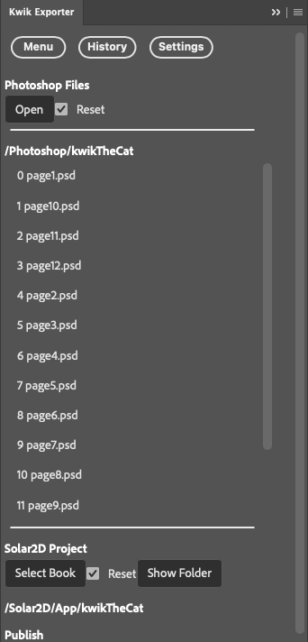

# kwikTheCat




```
.
├── LICENSE
├── Photoshop
│   ├── kwikTheCat
│   │   ├── Template21078_957-933.psd
│   │   ├── feature_graphic.psd
│   │   ├── icon.psd
│   │   ├── icon_splash_launch-assets
│   │   ├── page1.psd
│   │   ├── page10.psd
│   │   ├── page11.psd
│   │   ├── page12.psd
│   │   ├── page2.psd
│   │   ├── page3.psd
│   │   ├── page4.psd
│   │   ├── page5.psd
│   │   ├── page6.psd
│   │   ├── page7.psd
│   │   ├── page8.psd
│   │   ├── page9.psd
│   │   ├── read2me
│   │   │   └── narrations.txt
│   │   ├── screenshots.psd
│   │   └── splash.psd
│   ├── kwikconfig.json
│   ├── page1.png
│   ├── page1_1920x1080.png
│   ├── page5_1920x1080.png
│   └── tablet_1920x1080.png
├── README.md
├── Solar2D
    ├── AndroidResources
    ├── App
    │   ├── bookstore.lua
    │   ├── kwikTheCat
    │
    ├── Icon-osx.icns
    ├── Icon-win32.ico
    ├── Images.xcassets
    ├── LaunchScreen.storyboardc
    ├── License.md
    ├── README.md
    ├── build.settings
    ├── build.settings.dev
    ├── build.settings.prod
    ├── compress.command
    ├── config.lua
    ├── config.lua.dev
    ├── config.lua.prod
    ├── create_dummy_images.command
    ├── custom
    │   ├── commands
    │   │   ├── myEvent.lua
    │   │   └── page_reload.lua
    │   └── components
    │       ├── align.lua
    │       ├── bookstoreNavigation.lua
    │       ├── index.lua
    │       ├── keyboardNavigation.lua
    │       ├── kwikTheCatCommon.lua
    │       ├── myComponent.lua
    │       ├── page_navigation.lua
    │       ├── screen.lua
    │       └── thumbnailNavigation.lua
    ├── en.lproj
    ├── main.lua
    ├── main.lua.dev
    ├── main.lua.droid
    ├── main.lua.prod
    ├── mySplashScreen.png
```